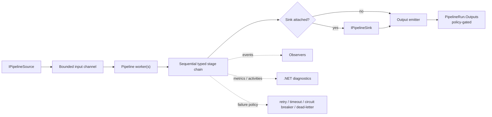

# SmartPipe.Core

**Typed, bounded, in-process streaming pipelines for .NET 10.**

[](https://www.nuget.org/packages/SmartPipe.Core)
[](https://www.nuget.org/packages/SmartPipe.Core)
[](https://github.com/MrFr3di/SmartPipe-Core/actions/workflows/ci.yml)
[](#compatibility)
[](LICENSE)

SmartPipe.Core runs explicit `source -> transform -> sink` pipelines inside your
process. It combines bounded channels, typed envelopes, explicit component
ownership, retry/timeout/circuit-breaker stage handling, observer events,
metrics, tracing, dead-letter records, graceful drain/cancel/abort semantics,
and a modular integration package ecosystem.

SmartPipe is not a distributed workflow engine, broker, durable queue, or
exactly-once delivery system. The runtime stays in-process and leaves durable
storage, replay after process loss, distributed coordination, and application
idempotency to the caller.

## Highlights

- **Typed runtime model.** Sources produce `ProcessingEnvelope<T>`, transforms
  return `StageResult<T>`, sinks consume typed envelopes, and
  `PipelineRun<T>` exposes completion, state, metrics, controls, and outputs.
- **Bounded backpressure.** Input, output, and buffered-observer channels are
  bounded; wait and lossy modes are explicit and observable.
- **Explicit ownership and lifetime.** Runtime-owned, scope-owned, and borrowed
  components have different initialization and disposal contracts.
- **Reusable definitions without hidden activation.** Canonical definitions
  validate and snapshot structure without invoking factories; reusable
  definitions create fresh per-run components.
- **Failure policy in the runtime.** Retry, timeout, circuit breaker,
  dead-letter routing, and terminal failure actions are stage-level contracts.
- **Graceful lifecycle.** Drain, cancel, abort, terminal-state publication, and
  cleanup are coordinated through one run lifecycle.
- **Built-in diagnostics.** Core emits stable .NET metrics and activities;
  exporter selection remains application-owned.
- **Modular integrations.** JSON, CSV, Dapper, EF Core, Mapster, HTTP, Polly,
  DI, Hosting, HealthChecks, OpenTelemetry, PostgreSQL, and other capabilities
  live in narrow packages.
- **Compatibility is explicit.** The 2.2 compatibility facade uses documented
  type forwarding/wrappers for retained 2.1.2 identities and documented
  removals where migration and recompilation are required.
- **AOT claims are scoped.** Core and several leaves have positive trim/AOT
  contracts; reflection-heavy integrations are annotated or deliberately make
  no blanket claim.

## Install

For the runtime only:

```bash
dotnet package add SmartPipe.Core --version 2.2.0
```

Add only the integration packages your application needs:

```bash
dotnet package add SmartPipe.Extensions.Json --version 2.2.0
dotnet package add SmartPipe.Extensions.DependencyInjection --version 2.2.0
dotnet package add SmartPipe.Extensions.Hosting --version 2.2.0
```

Existing applications that intentionally want the broad 2.2 compatibility
bundle can reference:

```bash
dotnet package add SmartPipe.Extensions --version 2.2.0
```

New applications should prefer the narrow leaf packages.

## Quick start

### Run a typed pipeline

```csharp
var run = PipelineBuilder
    .From(PipelineSource.FromAsyncEnumerable(items))
    .Transform(PipelineTransformer.FromFunc<int, string>(
        static (value, cancellationToken) =>
            ValueTask.FromResult(value.ToString())))
    .To(PipelineSink.FromFunc<string>(
        static (value, cancellationToken) =>
            ValueTask.CompletedTask));

await run.Completion;
```

For sink-backed pipelines, the default output policy is
`SuppressSuccessWhenSinkAttached`: successful items are not also written to
`PipelineRun<T>.Outputs` unless the caller explicitly selects `EmitAll`.

### Build a canonical reusable definition

```csharp
PipelineDefinition<int, string> definition = PipelineDefinitionBuilder
    .From(
        new PipelineKey("orders"),
        PipelineComponent.RuntimeOwned<IPipelineSource<int>>(
            static (_, _) =>
                ValueTask.FromResult<IPipelineSource<int>>(new OrderSource())))
    .Transform(
        new PipelineStageKey("format"),
        PipelineComponent.RuntimeOwned<IPipelineTransformer<int, string>>(
            static (_, _) =>
                ValueTask.FromResult<IPipelineTransformer<int, string>>(
                    PipelineTransformer.FromFunc<int, string>(
                        static (value, _) =>
                            ValueTask.FromResult(value.ToString())))))
    .Build();

await using PipelineRun<string> run =
    await definition.StartAsync(cancellationToken);

await run.Completion;
```

A definition is reusable only when its source, stages, and optional sink are
per-run descriptors and it retains no borrowed observer/dead-letter state.
Borrowed component instances remain caller-owned and make the definition
single-use.

### Register with DI and the Generic Host

```csharp
using SmartPipe.Extensions.DependencyInjection;
using SmartPipe.Extensions.Hosting;

var smartPipe = services.AddSmartPipe();

smartPipe
    .AddPipeline(definition)
    .RunAsHostedService(options =>
    {
        options.Order = 0;
        options.DrainTimeout = TimeSpan.FromSeconds(30);
    });
```

Each accepted DI run gets one async scope. Hosted pipelines are started in
deterministic order and stopped in reverse order.

## Common tasks

| Goal | Package / API |
| --- | --- |
| Run an in-process typed pipeline | `SmartPipe.Core`, `PipelineBuilder`, `PipelineDefinitionBuilder` |
| Reuse a definition across runs | Per-run `PipelineComponent.RuntimeOwned` / `ScopeOwned` descriptors |
| Register typed pipelines in DI | `SmartPipe.Extensions.DependencyInjection` |
| Run pipelines under Generic Host | `SmartPipe.Extensions.Hosting` |
| Add liveness/readiness | `SmartPipe.Extensions.HealthChecks` |
| Export Core metrics/traces | `SmartPipe.Extensions.OpenTelemetry` + application-owned exporter |
| Read/write JSON | `SmartPipe.Extensions.Json` |
| Read/write strict bounded CSV | `SmartPipe.Extensions.Csv` |
| Execute explicit SQL with Dapper | `SmartPipe.Extensions.Dapper` |
| Stream EF Core queries | `SmartPipe.Extensions.EntityFrameworkCore` |
| Map objects with Mapster | `SmartPipe.Extensions.Mapster` |
| Use streaming HTTP transport | `SmartPipe.Extensions.Http` |
| Add source-generated HTTP JSON codecs | `SmartPipe.Extensions.Http.Json` |
| Decorate transforms with Polly | `SmartPipe.Extensions.Polly` |
| Use PostgreSQL binary COPY or LISTEN/NOTIFY | `SmartPipe.Extensions.PostgreSql` |
| Test pipeline components without a test framework dependency | `SmartPipe.Testing` |
| Keep the broad 2.x compatibility surface | `SmartPipe.Extensions` |

## How it works



The stage chain for one envelope is sequential. `MaxConcurrency > 1` allows
multiple envelopes to be processed concurrently, so cross-envelope output order
is not guaranteed.

## Runtime contracts

| Contract | Behavior |
| --- | --- |
| Execution boundary | In-process only |
| Input/output queues | Bounded |
| Default sink-backed output | `SuppressSuccessWhenSinkAttached` |
| Output readers | One reader by contract; user code owns fan-out |
| Instance pipelines | Single-use |
| All-factory definitions | Reusable when no borrowed retained state exists |
| `DrainAsync` | Stops source intake and waits for accepted work |
| `CancelAsync` | Cooperative cancellation of source and in-flight processing |
| `AbortAsync` | Immediate-stop intent with abort precedence over ordinary cancellation |
| Cleanup | Best-effort complete; owned resources are attempted even after an earlier cleanup failure |
| Exactly-once | Not provided |
| Durable queue / crash replay | Not provided by Core |

See [Runtime contracts](docs/runtime-contracts.md) for the full lifecycle,
ownership, failure-precedence, observer, and channel semantics.

## Package ecosystem

| Package | Responsibility | AOT / trimming contract |
| --- | --- | --- |
| `SmartPipe.Core` | Runtime, typed definitions, diagnostics | full |
| `SmartPipe.Extensions.Channels` | Channel merge primitives | full |
| `SmartPipe.Extensions.Transforms` | Composable transforms | full |
| `SmartPipe.Extensions.Logging` | Logging sinks | full |
| `SmartPipe.Extensions.Json` | JSON files, transforms, dead-letter persistence | source-generated `JsonTypeInfo` path |
| `SmartPipe.Extensions.Csv` | Strict bounded CSV files | verified, no blanket claim |
| `SmartPipe.Extensions.Dapper` | Explicit-SQL Dapper integration | explicit-SQL scoped contract |
| `SmartPipe.Extensions.EntityFrameworkCore` | Provider-neutral EF Core query sources | no blanket claim |
| `SmartPipe.Extensions.Mapster` | Mapster transforms | no blanket claim; runtime mapping is reflection/dynamic-code sensitive |
| `SmartPipe.Extensions.Polly` | Polly transform decorator | verified |
| `SmartPipe.Extensions.Http` | Streaming HTTP transport | full transport contract |
| `SmartPipe.Extensions.Http.Json` | Source-generated HTTP JSON codecs | full `JsonTypeInfo` path |
| `SmartPipe.Extensions.DependencyInjection` | Keyed DI registration and run factories | full |
| `SmartPipe.Extensions.OpenTelemetry` | Exporter-neutral diagnostics registration | verified |
| `SmartPipe.Extensions.Hosting` | Generic Host orchestration | full |
| `SmartPipe.Extensions.HealthChecks` | Pipeline liveness/readiness | full |
| `SmartPipe.Extensions.DataAnnotations` | DataAnnotations validation | reflection boundary annotated |
| `SmartPipe.Extensions.PostgreSql` | Binary COPY and LISTEN/NOTIFY | verified slim/static path |
| `SmartPipe.Testing` | Test helpers | test-only, not a runtime AOT claim |
| `SmartPipe.Extensions` | Broad compatibility facade/bundle | no blanket claim |

`SmartPipe.Extensions` has 17 direct SmartPipe dependencies and 18 SmartPipe
IDs in its closure including the facade itself. The optional PostgreSQL package
and test-only `SmartPipe.Testing` stay outside the bundle.

Leaf packages must not depend back on the broad facade.

## Compatibility with 2.1.2

The immutable 2.1.2 facade baseline contains 42 relevant public identities.

| 2.2 treatment | Count |
| --- | ---: |
| Preserved through type forwarding | 23 |
| Retained physically in the compatibility facade | 13 |
| Intentionally removed | 6 |

The six deliberate removals are:

- `HttpSelector<T>`
- `HttpClientFactorySelector<T>`
- `HttpSink<T>`
- `HttpClientFactorySink<T>`
- `HttpSelectorStreamingMode`
- `PollyResilienceTransform<T>`

Consumers using those identities must migrate and recompile. Retained binary
compatibility is validated separately from source compatibility; namespace
preservation alone is not treated as binary evidence.

See the [2.1.2 → 2.2.0 migration guide](docs/migration/2.2.0-integration-packages.md),
[compatibility matrix](docs/implementation/2.2.0/sp220-17-compatibility-matrix.md),
and [ADR-0004](docs/adr/0004-smartpipe-2.2-breaking-migration.md).

## Lifecycle model

```text
Created -> Running
Running -> Draining -> Completed
Running -> Cancelled
Running -> Aborted
Running -> Faulted
Completed / Cancelled / Aborted / Faulted -> Disposed
```

Terminal precedence is:

```text
processing or mandatory cleanup fault
    > abort request
    > cancellation request
    > completion
```

Runtime-created components are disposed by the runtime. Borrowed components,
borrowed observers, and objects retained by dead-letter options remain
caller-owned.

## Compatibility

| Area | Support |
| --- | --- |
| Runtime target | `net10.0` |
| Repository SDK | pinned .NET SDK `10.0.303` |
| Core NativeAOT / trimming | positive package contract |
| Integration NativeAOT / trimming | package-specific; see package table and [AOT guide](docs/aot-compatibility.md) |
| Input model | typed async sources over bounded runtime channels |
| DI / Hosting | optional leaf packages |
| Persistence | application/integration responsibility; Core is not a durable queue |
| Distributed coordination | out of scope |
| Compatibility baseline | immutable 2.1.2 package assets plus source/binary consumer validation |

## Repository map

```text
src/                         Core, integration leaves, compatibility facade, Testing
tests/                       unit, lifecycle, integration and repository-contract tests
tests/Consumers/             packed-package source/binary/trim/NativeAOT consumers
benchmarks/                  BenchmarkDotNet release/performance evidence
docs/                        runtime, architecture, migration and subsystem guides
docs/adr/                    architecture decisions
docs/governance/             branch/review/release governance
docs/implementation/         implementation evidence and compatibility matrices
docs/plans/                  2.2 architecture and EPIC plans
eng/                         package graph, ownership, consumers, release validators
eng/baselines/2.1.2/         immutable compatibility baseline
agent_docs/                  repository orientation for coding agents
CONTRIBUTING.md              contribution workflow
SECURITY.md                  vulnerability reporting
```

### For coding agents

Read the repository architecture, the nearest package README/specification, and
the applicable governance/EPIC plan before changing compatibility-sensitive
code. Package ownership, forwarding/removal records, consumer scenarios,
lifecycle semantics, AOT claims, and exact-head evidence are contracts, not
incidental implementation detail.

Start with:

- [Architecture](docs/architecture.md)
- [Runtime contracts](docs/runtime-contracts.md)
- [2.2 architecture plan](docs/plans/2.2.0-extension-architecture.md)
- [2.2 branch and review policy](docs/governance/2.2.0-branch-and-review-policy.md)
- [Package authoring](docs/contributing/package-authoring.md)

## Building from source

The repository pins .NET SDK `10.0.303` in `global.json` and uses Microsoft
Testing Platform.

```bash
dotnet restore SmartPipe.Core.slnx --locked-mode
dotnet format SmartPipe.Core.slnx --verify-no-changes --no-restore
dotnet build SmartPipe.Core.slnx -c Release --no-restore -warnaserror
```

Run the tests for the affected projects while iterating. For example:

```bash
dotnet test --project tests/SmartPipe.Core.Tests/SmartPipe.Core.Tests.csproj -c Release --no-build
dotnet test --project tests/SmartPipe.Extensions.Tests/SmartPipe.Extensions.Tests.csproj -c Release --no-build
```

Repository/package changes also use `eng/SmartPipe.RepositoryChecks` and
packed-package consumer validation. See [CONTRIBUTING.md](CONTRIBUTING.md).

## Documentation

- [Getting started](docs/getting-started.md)
- [Runtime contracts](docs/runtime-contracts.md)
- [Configuration](docs/configuration.md)
- [Resilience](docs/resilience.md)
- [Architecture](docs/architecture.md)
- [Dependency injection](docs/dependency-injection.md)
- [Hosting](docs/hosting.md)
- [Health checks](docs/health-checks.md)
- [OpenTelemetry](docs/opentelemetry.md)
- [PostgreSQL](docs/postgresql.md)
- [AOT and trimming](docs/aot-compatibility.md)
- [API reference](docs/api-reference.md)
- [2.2.0 release notes](docs/releases/2.2.0.md)
- [2.1.2 → 2.2.0 migration](docs/migration/2.2.0-integration-packages.md)
- [Compatibility matrix](docs/implementation/2.2.0/sp220-17-compatibility-matrix.md)
- [Package authoring](docs/contributing/package-authoring.md)
- [Changelog](CHANGELOG.md)

## Contributing

Issues and pull requests are welcome. See [CONTRIBUTING.md](CONTRIBUTING.md).

Changes to Core lifecycle, public API, package boundaries, type forwarding,
compatibility ownership, release workflows, security boundaries, or scoped
AOT/trimming claims require proportional review and evidence.

## Security

Do not publish exploit details in a normal issue. Follow
[SECURITY.md](SECURITY.md) and use the repository's private security reporting
path when available.

## License

[MIT](LICENSE)
